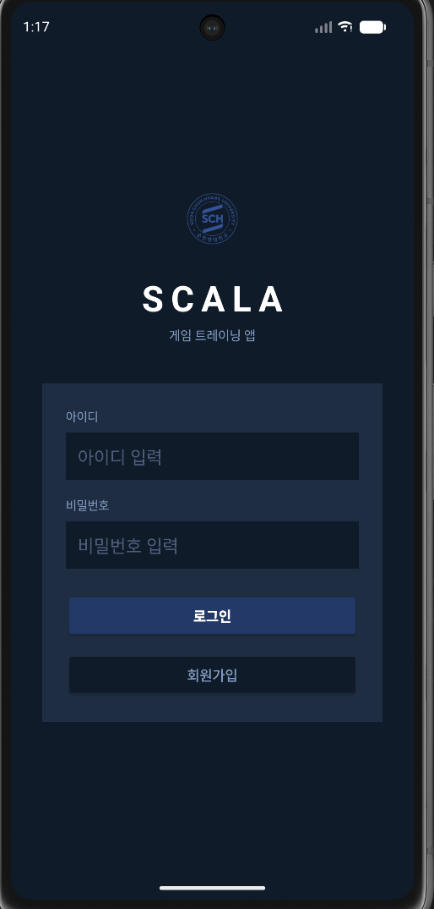
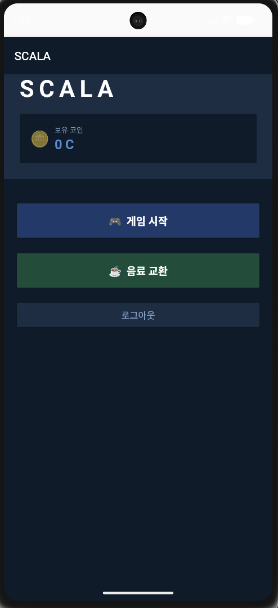
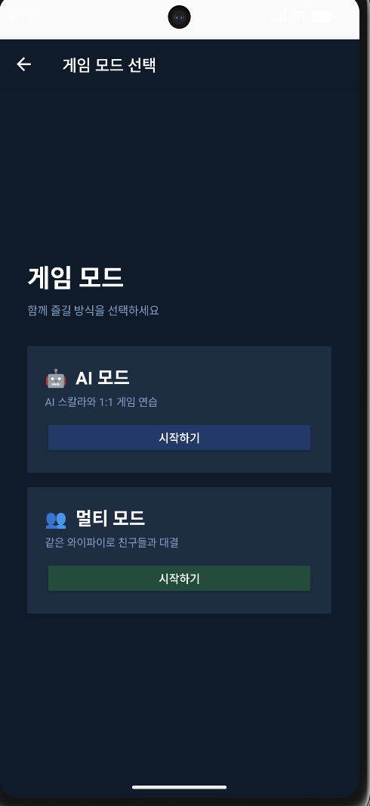
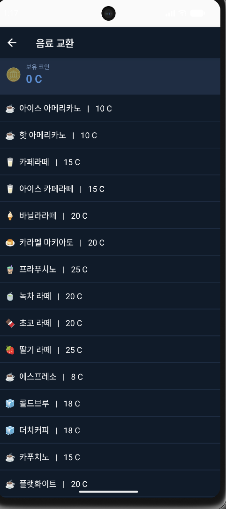
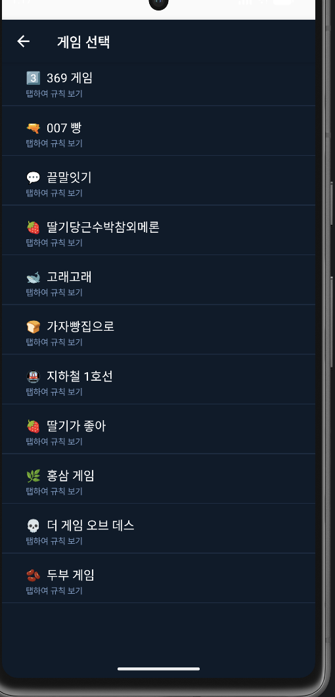
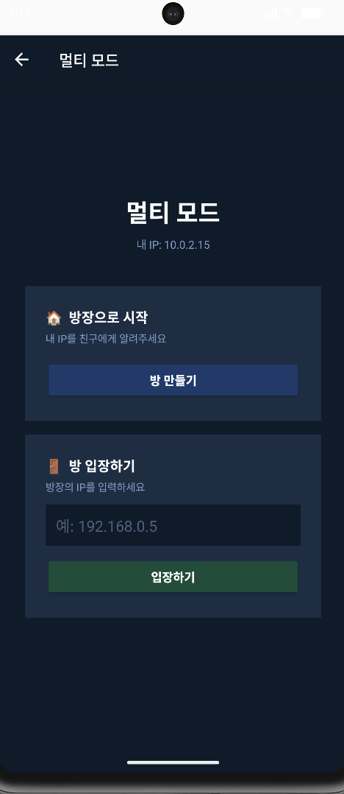
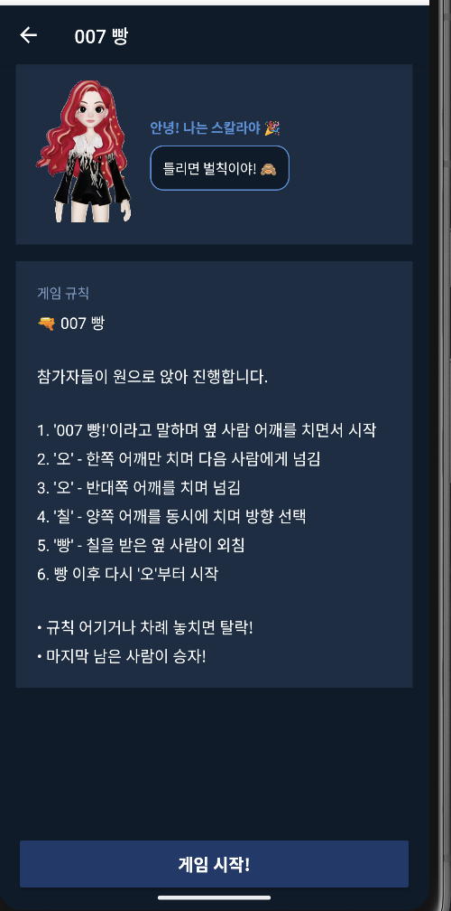
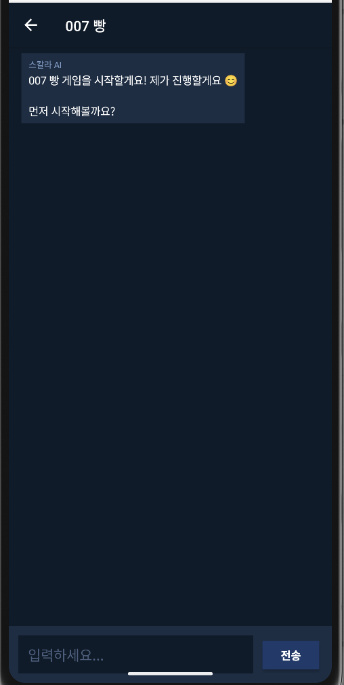

# 🎮 SCALA - 순천향대학교 게임 트레이닝 앱

  
  
  
  

  
  
  
  

---

## 📱 소개

순천향대학교 마스코트 **스칼라**와 함께 즐기는 게임 트레이닝 앱입니다.
AI와 함께 게임을 연습하고, 친구들과 로컬 멀티플레이도 즐길 수 있어요.
게임에서 얻은 코인으로 교내 음료를 교환할 수 있습니다.

---

## ✨ 주요 기능

- 🤖 **AI 모드** - Groq AI(LLaMA 3.3 70B)와 함께 게임 연습
- 👥 **멀티 모드** - 같은 와이파이로 친구들과 실시간 대결
- 📖 **게임 규칙 설명** - 스칼라 캐릭터가 직접 규칙 설명
- 🪙 **코인 시스템** - 게임 결과에 따라 코인 적립/차감
- ☕ **음료 교환** - 적립한 코인으로 18종 음료 교환

---

## 🎯 게임 목록

| # | 게임 이름 |
|---|----------|
| 1 | 369 게임 |
| 2 | 007 빵 |
| 3 | 끝말잇기 |
| 4 | 딸기당근수박참외메론 |
| 5 | 고래고래 |
| 6 | 가자빵집으로 |
| 7 | 지하철 1호선 |
| 8 | 딸기가 좋아 |
| 9 | 홍삼 게임 |
| 10 | 더 게임 오브 데스 |
| 11 | 두부 게임 |

---

## 🛠 기술 스택

| 분류 | 기술 |
|------|------|
| Language | Java |
| Platform | Android (API 26+) |
| AI | Groq API (LLaMA 3.3 70B) |
| Network | Java Socket (로컬 멀티플레이) |
| Storage | SharedPreferences |
| UI | XML Layout |

---

## 📥 다운로드

[ScalaApp.apk](ScalaApp.apk) 다운로드 후 설치하세요!

> ⚠️ 설치 전 **출처를 알 수 없는 앱 허용** 설정 필요

---

## 👩‍💻 개발 정보

- **학교:** 순천향대학교 컴퓨터공학과
- **개발 환경:** Android Studio, macOS
- **개발 기간:** 2026년 5월

---

  Made with by 민식

